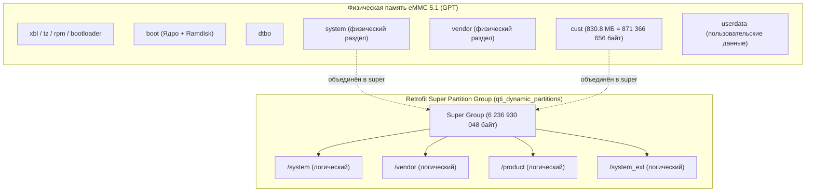
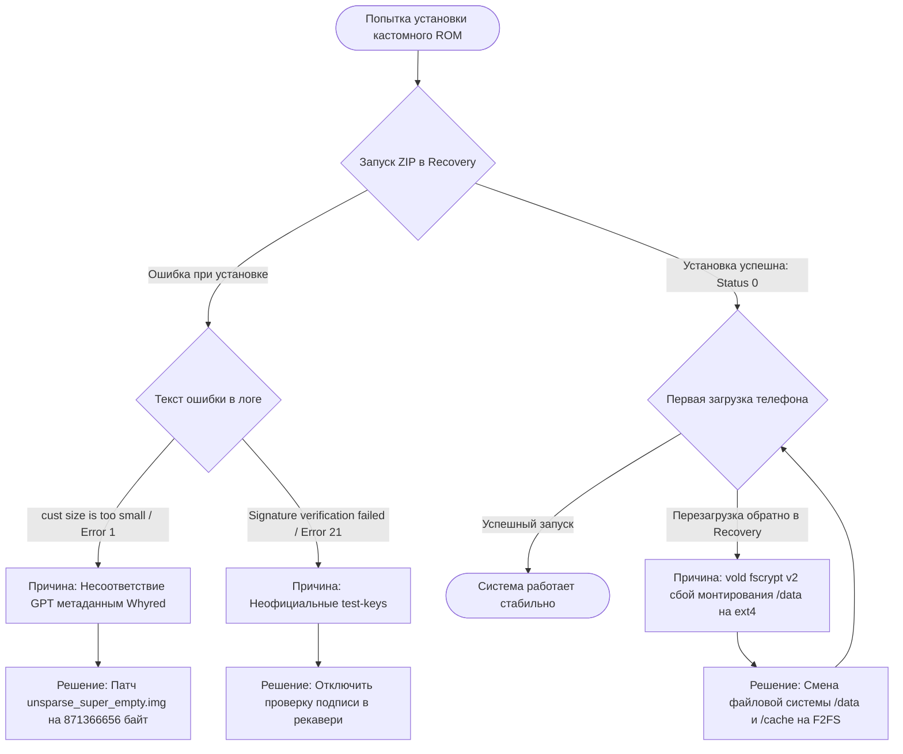

# Архитектура разделов и схемы диагностики / Partition Architecture Diagrams

## 1. Схема разметки памяти Redmi Note 6 Pro (Tulip)

```mermaid
graph TD
    subgraph eMMC ["Физическая память eMMC 5.1 (GPT)"]
        xbl["xbl / tz / rpm / bootloader"]
        boot["boot (Ядро + Ramdisk)"]
        dtbo["dtbo"]
        system_phys["system (физический раздел)"]
        vendor_phys["vendor (физический раздел)"]
        cust_phys["cust (830.8 МБ = 871 366 656 байт)"]
        userdata["userdata (пользовательские данные)"]
    end

    subgraph RetrofitSuper ["Retrofit Super Partition Group (qti_dynamic_partitions)"]
        system_phys -. объединён в super .-> super_group["Super Group (6 236 930 048 байт)"]
        cust_phys -. объединён в super .-> super_group
        super_group --> dyn_system["/system (логический)"]
        super_group --> dyn_vendor["/vendor (логический)"]
        super_group --> dyn_product["/product (логический)"]
        super_group --> dyn_system_ext["/system_ext (логический)"]
    end
```

---

## 2. Алгоритм диагностики и устранения ошибок установки

```mermaid
flowchart TD
    Start(["Попытка установки кастомного ROM"]) --> CheckRecovery{"Запуск ZIP в Recovery"}
    
    CheckRecovery -->|Ошибка при установке| DetectError{"Текст ошибки в логе"}
    
    DetectError -->|cust size is too small / Error 1| CauseCust["Причина: Несоответствие GPT метаданным Whyred"]
    CauseCust --> PatchSolution["Решение: Патч unsparse_super_empty.img на 871366656 байт"]
    
    DetectError -->|Signature verification failed / Error 21| CauseSig["Причина: Неофициальные test-keys"]
    CauseSig --> SigSolution["Решение: Отключить проверку подписи в рекавери"]
    
    CheckRecovery -->|Установка успешна: Status 0| BootPhone{"Первая загрузка телефона"}
    
    BootPhone -->|Успешный запуск| Done(["Система работает стабильно"])
    BootPhone -->|Перезагрузка обратно в Recovery| CauseF2FS["Причина: vold fscrypt v2 сбой монтирования /data на ext4"]
    CauseF2FS --> F2FSSolution["Решение: Смена файловой системы /data и /cache на F2FS"]
    F2FSSolution --> BootPhone
```
